# 在 DeepSeek Harness 里落地可审计、可协作的五阶段 SDD 开发流程

> 本文基于 `dsh-e2e-dev-sdd` 当前实现编写，页面截图来自实际运行中的 DSH Web。示例项目使用“测试 AI 能力边界”作为业务需求，演示从需求导入、阶段对话、交付件验收到隔离代码开发的完整过程。

传统的 AI 编程对话很容易遇到三个问题：需求结论停留在聊天记录里、设计与代码缺少可追踪关系、不同角色不得不在同一个长会话中互相等待。`dsh-e2e-dev-sdd` 的目标不是把五个阶段变成一条无人值守流水线，而是把每个阶段做成一个独立、可恢复、可验收的 AI 工作台。

使用者只需要打开一个 Git 工作空间，选择当前要完成的阶段，选择本轮允许使用的输入，与 AI 讨论并迭代，最终把交付件和项目状态一起提交到文件仓库。简单需求可以跳过原型或架构阶段；复杂需求也可以完整走完需求讨论、原型输出、系统设计、规格设计和开发测试。

## 一、这套流程解决什么问题

一个 DSH Workspace 对应一个 SDD 项目空间，项目内的 `.sdd/` 是流程真源。浏览器页面、AI 会话和项目看板都是这批文件的视图，而不是独立保存一份不可提交的状态。

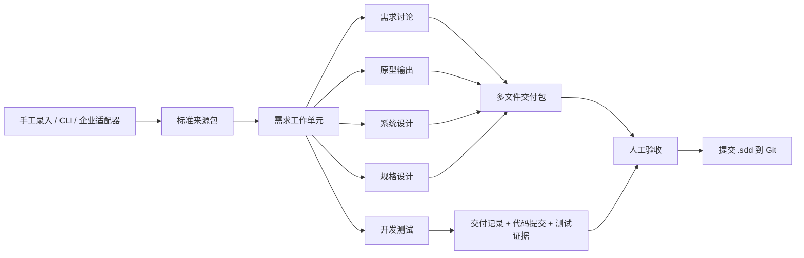

五个阶段是独立能力，不是强制的顺序按钮。默认 `flexible` 模式允许使用者按需求选择输入和跳过阶段；只有项目明确启用 `strict` 模式时，才会执行配置中的必需依赖。

| 阶段 | 主要角色 | 重点输入 | 标准交付 |
| --- | --- | --- | --- |
| 需求讨论 | 产品、需求分析师 | 原始需求、缺陷、访谈结论 | `REQ-*` 需求规格说明 |
| 原型输出 | 产品设计、交互设计 | 需求交付件、设计资料 | `UX-*` 原型与交互规格及附件 |
| 系统设计 | 架构师、技术负责人 | 需求、可选原型 | `ARCH-*` 系统设计说明、仓库范围 |
| 规格设计 | 开发负责人、模块负责人 | 需求、架构、可选原型 | `SPEC-*` 实现规格、开发目标 |
| 开发测试 | 开发、测试、Reviewer | 任意已接受上游交付件 | `DEV-*` 交付记录、代码、测试证据 |

角色只是使用视角，插件当前不做角色权限封锁。每个人可以专注维护自己负责阶段的交付件，同时通过固定输入版本与上下游保持可追踪关系。

## 二、安装并打开项目

从 GitHub 安装插件：

```sh
dsh plugin --profile web add github:Army1900/dsh-e2e-dev-sdd
```

本地开发版本在 macOS/Linux 中使用：

```sh
pnpm install
pnpm build
dsh plugin --profile web add link:$(pwd)
```

Windows PowerShell 使用：

```powershell
pnpm install
pnpm build
dsh plugin --profile web add "link:$($PWD.Path)"
```

安装后必须结束旧的 `dsh web` 进程并重新启动。只刷新浏览器不会重新加载插件。可以运行下面的命令确认配置中出现 `e2e-dev-sdd`：

```sh
dsh --profile web --dump-config
```

在 DSH Web 打开一个 Git 目录后，插件检查 `.sdd/project.yaml`：

- 未初始化：页面提供“初始化项目”，生成项目配置、五阶段模板和业务扩展目录。
- 配置合法：直接读取项目看板及工作单元。
- 配置不合法：展示字段级错误；可以修复配置，也可以先备份旧配置再重新初始化。

初始化后的核心目录如下：

```text
.sdd/
├── project.yaml                         # 项目编号、流程和代码仓配置
├── templates/<stage>/                  # 项目可编辑的五阶段模板
├── sources/                            # 外部来源的版本化快照
├── imports/pending/                    # 尚未应用的同步预览
├── work-items/<uid>/
│   ├── work-item.yaml                  # 单条可独立交付需求
│   └── artifacts/<stage>/<artifact>/   # 阶段多文件交付包
├── business/                           # 企业 Connector 和适配器
├── runs/                               # 阶段与 DSH Session 的固定绑定
├── development/                        # 隔离代码空间登记和测试证据
└── events/                             # 看板使用的追加式事件日志
```

## 三、先从项目看板了解全局状态

项目看板是只读投影，不在浏览器中另存统计值。阶段状态来自交付件，需求与缺陷来自来源快照，代码和测试状态来自 Git 与开发空间登记，最近活动来自事件日志。

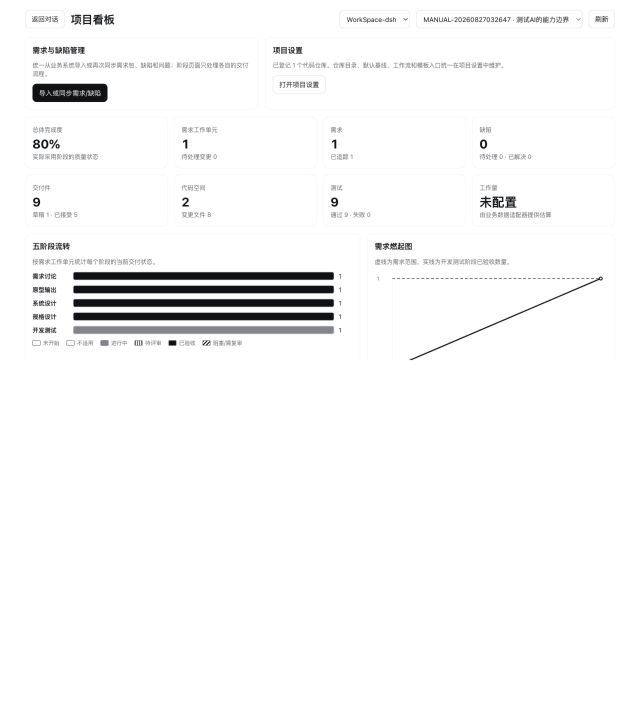

看板重点回答五类问题：

1. 当前一共有多少需求工作单元、需求和缺陷？
2. 每条需求走了哪些阶段，哪些阶段被标记为不适用？
3. 有多少交付件处于草稿、待评审或已验收状态？
4. 是否存在上游变化、未提交代码、失效测试等质量风险？
5. 某条需求当前可以直接进入哪个阶段工作台？

需求交付热力图的每个单元格都可以进入对应需求的阶段页面。燃起图展示需求范围与开发验收数量，而不是用人为填写的百分比伪造进度。

## 四、导入需求：默认开箱即用，也支持企业系统

需求和缺陷只在项目看板统一导入。各阶段页面不会重复承担业务来源管理，只在必要时提供同步入口。

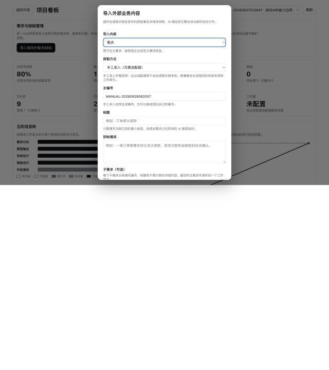

### 1. 手工录入

没有进行任何企业适配开发时，插件仍然可以完整使用。选择“手工录入”，填写：

- 主编号：需求包在外部世界中的编号；不填写时使用默认 `MANUAL-*` 编号。
- 标题和初始描述：允许信息不完整，后续由需求讨论阶段的 AI 追问。
- 子需求：每一项都包含独立编号、标题和不限行数的正文，可以用“＋”添加多条。

一个主编号可以对应多个子需求。每个可独立交付子需求会生成自己的工作单元，因此可以拥有自己的五阶段交付件、会话和代码开发空间。只有一条需求时，本质上就是 `items` 长度为 1 的需求包。

### 2. 企业适配器

企业适配器负责“读取事实”，不负责直接生成已验收交付件。无论来源是 CLI、MCP 还是内部需求平台，都先归一化为 `dsh-sdd/source-bundle@1`：

```text
企业系统 -> Connector/Adapter -> Source Bundle -> 变更预览 -> 工作单元
```

项目业务代码统一放在 `.sdd/business/`，避免脚本散落在仓库根目录：

```text
.sdd/business/
├── README.md
├── connectors/
└── adapters/
```

企业需求号、缺陷号和子需求号原样保存为外部编号。插件不会要求企业编号改变格式，也不会从编号字符串猜测父子关系。

### 3. 三类编号不要混用

| 编号 | 示例 | 用途 |
| --- | --- | --- |
| 技术身份 `uid` | UUID | 插件内部不可变身份和关联 |
| 阶段交付件编号 | `REQ-0001`、`UX-0001`、`ARCH-0001`、`SPEC-0001`、`DEV-0001` | 插件自己的阶段版本与追踪体系 |
| 企业外部编号 | `PAY-381`、`BUG-9021` | 与企业系统中的需求、缺陷关联 |

项目 `key` 只是当前本地 SDD 工作空间的标识，默认取目录名，不是企业需求编号。企业编号与插件交付件编号是“关联”关系，不会互相覆盖。

## 五、需求同步与变更识别

再次导入相同的 `provider + kind + externalKey` 就是同步。插件先展示新增、修改、移除和无变化项，用户确认后才写入项目。

同步不会覆盖旧来源，而是新增快照：

- 新增子项：创建新的工作单元。
- 修改子项：保留历史快照，并把相关工作单元标记为待处理变更。
- 外部移除：进入 `removed-pending`，不会自动删除本地交付件。
- 无变化：不制造空修订。

已经 accepted 的交付件始终冻结。只有创建明确的新修订并重新验收，变化才能向下游传播。

## 六、阶段工作的共同操作模型

五个阶段页面拥有相同骨架：选择输入、选择或创建交付件、绑定 AI 会话、同步结论、质量检查、人工验收。

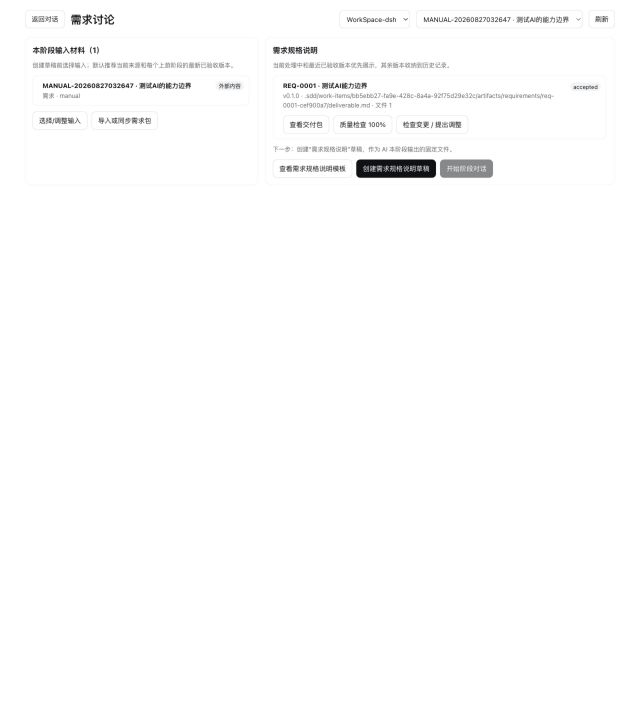

### 1. 选择本轮输入

创建草稿前，页面只展示精简的已选输入摘要；完整候选列表在弹窗中选择，避免交付件多时把页面无限拉长。

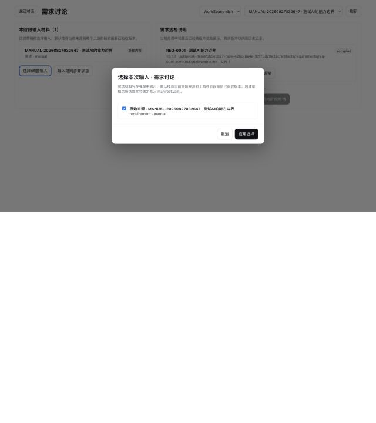

可被选中的输入只有：

- 当前工作单元的原始来源；
- 当前工作单元中更早阶段的 accepted 交付件。

默认会推荐当前来源和每个上游阶段的最新 accepted 版本。创建草稿后，选择结果固定写入该交付件的 `manifest.yaml`，不能在同一草稿里静默换版本。需要调整输入时，应创建修订。

这也是“对话和具体交付件固定绑定”的基础：一轮阶段运行始终知道自己在修改哪个目录、基于哪些版本、属于哪个工作单元。

### 2. 创建交付件草稿

“创建草稿”就是创建当前阶段交付件。它会：

1. 分配阶段编号和不可变 UID；
2. 固定本轮输入列表；
3. 复制当时的项目模板快照；
4. 初始化 `deliverable.md` 和 `manifest.yaml`；
5. 准备绑定一个原生 DSH Session。

因此，模板后来发生变化也不会悄悄改变已经创建的交付件。新修订可以显式采用新模板，并在变更检查中看到模板哈希差异。

### 3. 开始或恢复 AI 对话

每个阶段都有独立完整的 System Prompt，包括：

- 当前角色与阶段目标；
- 绑定交付件的绝对路径；
- 当前输入与固定版本；
- 页面所示的 Markdown 模板；
- 工具允许范围；
- 完成条件和验收清单；
- “已确认结论必须写入交付件”的落盘规则。

阶段运行记录保存在 `.sdd/runs/<runUid>.yaml`，固定绑定 `stage + artifactUid + sessionId + inputs`。恢复会话时，插件会重新读取交付件现状，并在原 Session 上恢复约束，不依赖浏览器是否还保留旧页面。

需求、原型、系统设计和规格设计阶段禁止 Shell 写操作；文件编辑只能发生在绑定交付件目录。开发测试阶段可以使用 `bash` 或 Windows `pwsh`，但代码操作必须明确指定注册过的隔离仓库目录。工具 Guard 在执行前拦截越界操作，约束不只存在于提示词中。

### 4. 同步结论与质量验收

AI 对话不是最终真源。每轮完成后，插件重新读取交付件并计算质量报告；“同步结论”会要求原会话重新整理已经确认的结论，并更新绑定文件。

质量检查验证：

- 必需的二级章节是否存在；
- 去除模板注释和三级标题后是否有实际内容；
- 是否还存在占位文本；
- 输入追踪和 Manifest 是否有效；
- 当前阶段的专属验收项是否完成。

最后的 accepted 动作必须由人从页面触发。验收时冻结多文件包的文件清单和 SHA-256，AI 不能自行把草稿标记为已验收。

## 七、五个阶段分别产出什么

### 阶段一：需求讨论

需求角色围绕原始来源与 AI 澄清业务目标、范围、流程、规则、非功能要求、验收标准和待决问题。原始描述可以很短，最终的 `deliverable.md` 可以是一篇长文档，并通过附件继续扩展。

需求阶段的关键不是“润色原文”，而是把不确定信息转化为可验证的约束，同时保留仍未确认的事项。

### 阶段二：原型输出

原型阶段可以生成长篇交互规格，也可以在交付包中增加 HTML、Mermaid、图片、用例模板等资源。

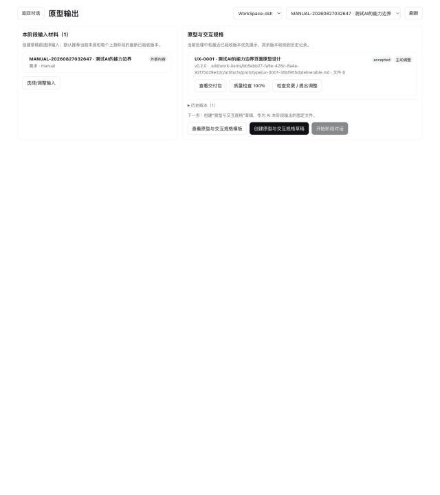

交付件不是单一 `deliverable.md`。页面展示完整文件树，Markdown 默认预览，支持切换源码；HTML、YAML、Mermaid 和附件都可以进入同一个受版本控制的交付包。

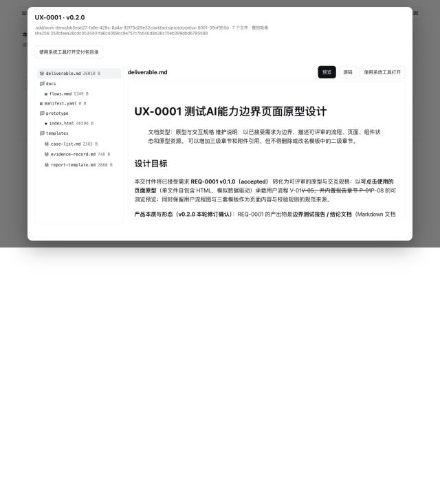

文件和目录可以调用宿主系统默认工具打开，Host 负责处理 macOS 与 Windows 的平台差异。模板查看默认进入源码，正式交付件默认进入预览。

### 阶段三：系统设计

系统设计角色描述系统边界、组件关系、数据与接口、部署、安全、风险和迁移方案，并确认这条需求可能涉及的代码仓库范围。

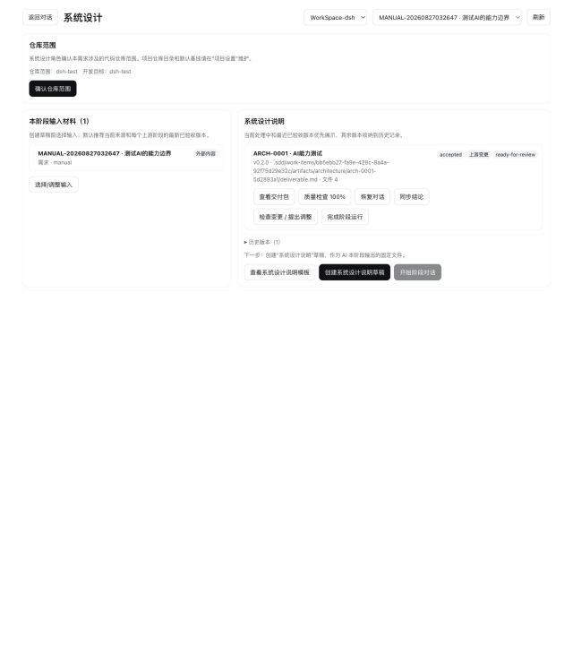

仓库目录不在每个阶段重复维护。系统设计只做需求级范围确认，仓库地址、默认基线等项目级事实统一放在“项目设置”。

### 阶段四：规格设计

规格设计把架构结论落实为开发可执行的模块目标、接口契约、数据变化、任务拆分、测试策略、兼容方案和验收映射。

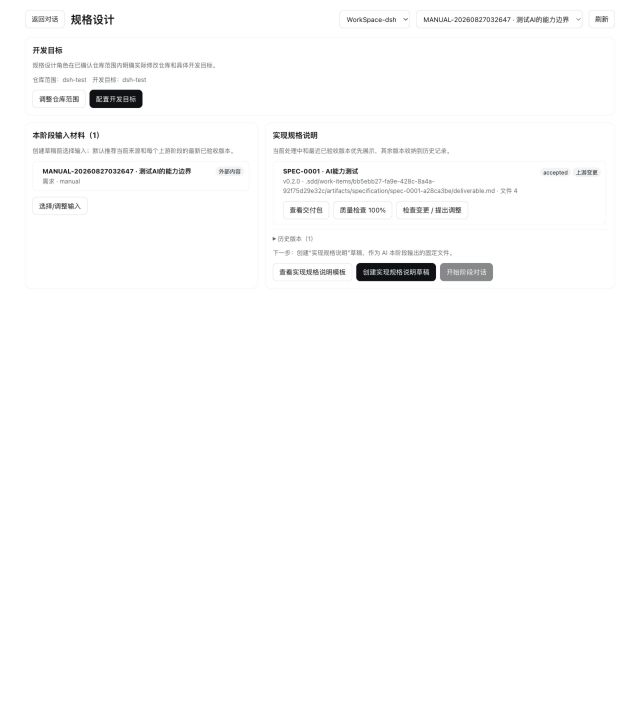

这一阶段在已确认的仓库范围内选择真正需要修改的仓库，并为每个仓库填写具体开发目标。系统设计回答“可能影响哪里”，规格设计回答“这次具体改哪里、改成什么”。

### 阶段五：开发测试

开发阶段可以从完整上游链路进入，也可以为简单需求直接选择原始来源和少量 accepted 交付件。页面会展示已固定输入、OpenSpec 状态、开发交付记录和验收门禁。

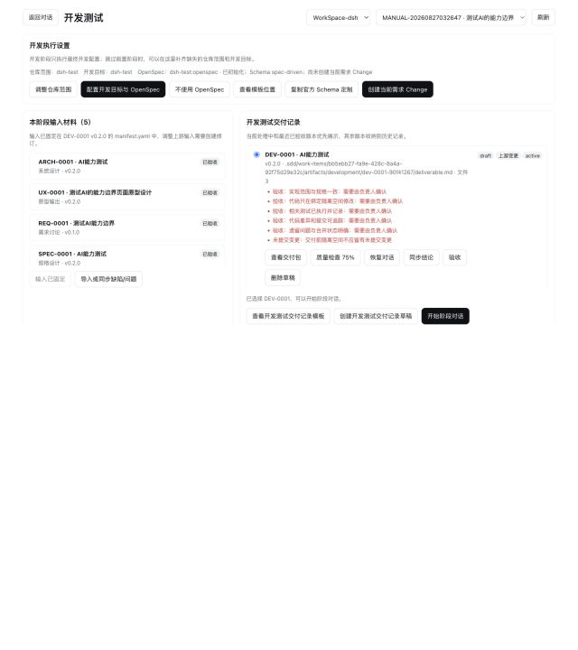

开发交付件记录实现范围、代码位置、提交、测试证据、遗留问题和合并状态；实际代码则提交到目标代码仓库，而不是复制进 `.sdd/`。

## 八、项目设置、代码仓库与特性分支

“项目设置”同时维护外层 SDD 项目仓库协作，以及开发阶段可用的目标代码仓库与开发规则。外层仓库可以查看分支、upstream、ahead/behind 和文件状态，执行 Fetch、仅 Fast-forward 同步、按范围提交及用户确认后的 Push；目标代码仓库仍保持独立的 Worktree/Clone 流程。

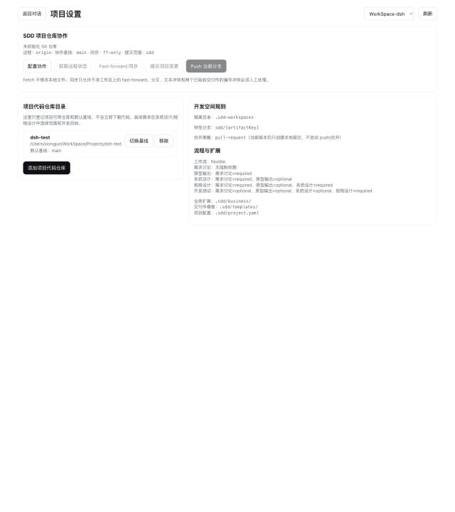

登记仓库只保存来源和默认基线，不会立刻下载代码：

- 本地仓库：读取本地分支和 `origin` 跟踪分支；开发时创建 Git Worktree。
- 远程仓库：通过 `git ls-remote` 获取分支；开发时再 Clone 到隔离目录。
- 刚 `git init` 但没有提交的本地仓库：经用户确认后可以创建安全的空初始提交。
- 空远程仓库：插件不自动执行远程 push，需负责人先显式初始化。

开发阶段为每个需求创建隔离代码空间：

```text
.sdd-workspaces/<artifact-key>/<repository-id>/
```

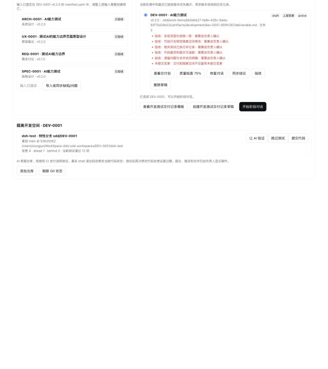

代码不会直接写在基线分支。默认从选定基线创建 `sdd/...` 特性分支：

```text
项目 SDD 仓库                       目标代码仓库
.sdd/artifacts/DEV-*                .sdd-workspaces/DEV-*/repo
  ├─ 交付记录                         ├─ sdd/DEV-* 特性分支
  ├─ commit/测试证据引用               ├─ 业务代码修改
  └─ 会话与输入绑定                    └─ 本地提交和测试
```

开发交付件创建新修订时，会复用同一工作单元的物理 Worktree 和特性分支，而不是重复复制代码；同时为新 artifact UID 建立登记，并让旧测试证据失效。这样既保留干净的代码空间，又避免“新修订目录已存在但没有注册”的冲突。

点击“让 AI 验证”后，不要求项目预先枚举 `pnpm test`、Maven、Gradle 或其他所有命令。AI 先读取仓库中的 `AGENTS.md`、README、构建入口、CI 配置及匹配的 `.agents/skills/*/SKILL.md`，再依据当前修改自主选择相关测试。

测试证据绑定真实退出码和当前代码指纹。测试后再次修改代码会让证据过期；只有当前代码存在通过或经用户说明的跳过证据时，插件才允许本地提交。当前版本不自动 push、不创建 PR/MR，也不自动合并，这些远程写操作仍由负责人检查后执行。

## 九、OpenSpec 如何参与开发

OpenSpec 是需求级可选增强，不是 SDD 开发的硬门禁，也不替代这套五阶段交付体系。

两者职责不同：

- 外层 SDD 项目负责业务来源、跨角色阶段交付、版本追踪、验收和项目看板。
- 代码仓内 OpenSpec 负责围绕具体代码变更维护 proposal、specs、design 和 tasks。

插件会分别检查宿主机是否存在 OpenSpec CLI，以及隔离代码仓中是否存在配置目录。用户可以：

1. 使用官方 `openspec init --tools ...` 初始化；
2. 查看当前 Schema 模板解析位置；
3. Fork 官方 `spec-driven` Schema 为仓库内可编辑模板；
4. 为当前需求显式创建 OpenSpec Change；
5. 或选择“不使用 OpenSpec”继续开发。

初始化后 `specs/` 和 `changes/` 为空是正常状态：初始化只准备配置和 AI 工具集成，不会凭空生成需求内容。创建当前需求 Change 后，开发会话才会在代码仓中维护对应的 OpenSpec 文件。

## 十、修订、主动调整与上游变更

交付件生命周期是：

```text
draft -> in-review -> accepted -> superseded
```

accepted 版本不能原地覆盖。点击“检查变更 / 提出调整”后，插件先比较：

- 原始来源版本与内容哈希；
- 已选上游交付件版本与整包哈希；
- 阶段模板版本与哈希。

存在真实差异时，创建“上游变更”修订；没有差异时，必须填写清晰的主动调整原因。空变化不能创建新修订。

新修订会复制完整交付包、记录 `supersedes`、版本号、变更类型和历史运行关联。它使用新的变更会话，会话名称包含变更类型与新版本；旧会话和旧交付件保持只读。未验收且不再需要的草稿可以移入 `.sdd/trash`，不会直接不可恢复地删除。

## 十一、一条需求的推荐操作清单

对一条普通业务需求，可以按下面的顺序工作：

1. 在 DSH Web 打开项目 Git 目录，按提示初始化 `.sdd/`。
2. 在项目设置登记可用代码仓库和默认基线。
3. 在项目看板手工录入需求包，或通过企业适配器同步来源。
4. 选择一个子需求工作单元。
5. 进入当前需要的阶段，选择本轮来源与 accepted 上游交付件。
6. 不需要的阶段标记为“不适用”，不要创建空交付件凑流程。
7. 创建当前阶段草稿并开始 AI 对话。
8. 在对话中澄清、迭代，让确定结论持续写入绑定交付包。
9. 返回页面预览所有文件，运行结构质量检查，确认人工验收清单。
10. 接受版本；需要调整时创建有依据的新修订。
11. 系统设计确认仓库范围，规格设计确认实际开发目标。
12. 开发阶段创建隔离空间和特性分支；按需启用 OpenSpec。
13. 让 AI 读取仓库规则、完成代码修改并执行相关测试。
14. 测试证据有效且工作区满足门禁后创建本地提交。
15. 人工检查后 push、创建 PR/MR 并合并；把 commit 和合并结果同步回开发交付件。
16. 在项目看板复查变更、测试、交付追踪矩阵，然后提交项目仓库中的 `.sdd/`。

对于极简单的修改，可以直接使用“原始来源 -> 开发测试”；对于跨系统复杂需求，可以完整使用五阶段。自由不意味着失去约束：实际采用的输入、交付件、会话、代码目录和测试证据仍然全部固定和可审计。

## 十二、当前能力边界

当前实现已经覆盖：

- 五阶段独立 System Prompt、工具 Guard、输入门禁和验收清单；
- 多来源、多子需求、同步预览和版本化来源快照；
- 可定制项目模板和多文件交付包；
- Markdown 预览、源码切换和跨平台系统工具打开；
- 会话与交付件固定绑定、恢复和逐轮质量刷新；
- 项目看板、燃起图、热力图与交付追踪矩阵；
- 多仓库 Worktree/Clone、特性分支、AI 驱动测试和提交门禁；
- 可选 OpenSpec 初始化、Schema 定制和需求 Change。

仍然明确留给负责人或后续扩展的能力包括：

- 目标代码仓库的 Git push、PR/MR 创建和自动合并；外层 SDD 项目仓库已支持显式 Push；
- 向企业需求系统回写状态；
- 内置通用 MCP Source Provider；
- 更完整的周期时间与趋势分析。

这种边界是刻意的：插件自动化的是“形成可靠上下文、守住文件边界、记录事实和验证交付”，而外部发布、合并与企业系统写入仍需要清晰的用户确认。

## 结语

这套 SDD 工作台真正改变的不是多了五个菜单，而是把 AI 开发过程从一次性聊天变成了项目资产：输入有版本，结论有文件，阶段有验收，变更有依据，代码有隔离空间，测试有真实证据。

当不同角色打开同一个仓库时，他们不必重新解释全部历史。产品角色维护需求，设计角色维护原型，架构与开发负责人确认仓库和实现边界，开发测试角色在特性分支完成代码；所有人最终围绕同一套可提交、可审阅、可恢复的 `.sdd/` 文件协作。
